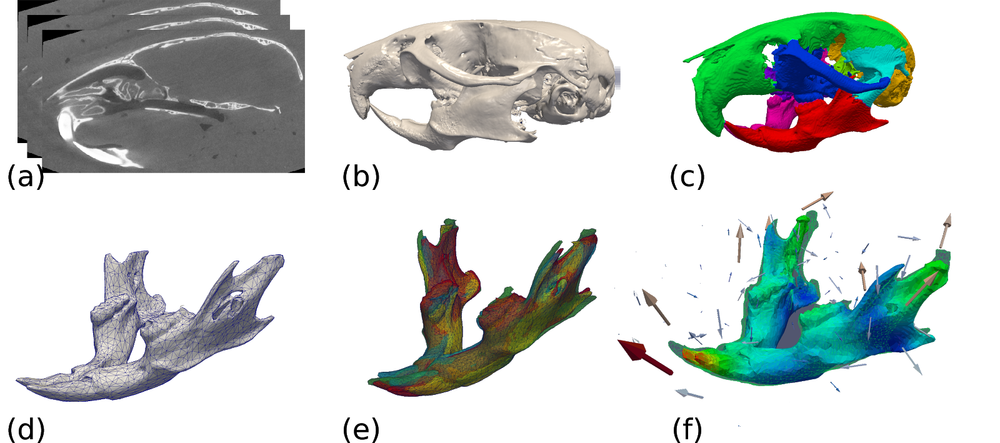
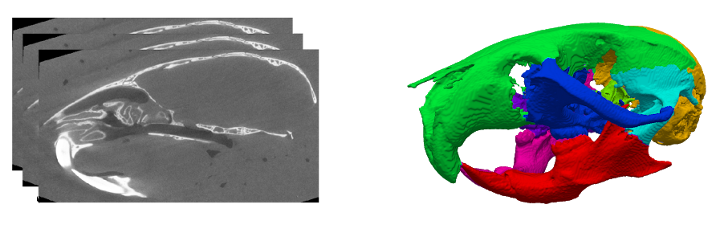
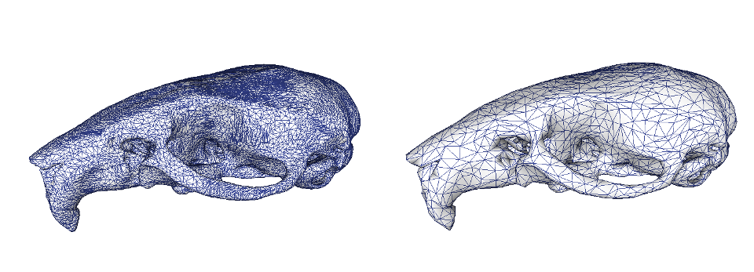
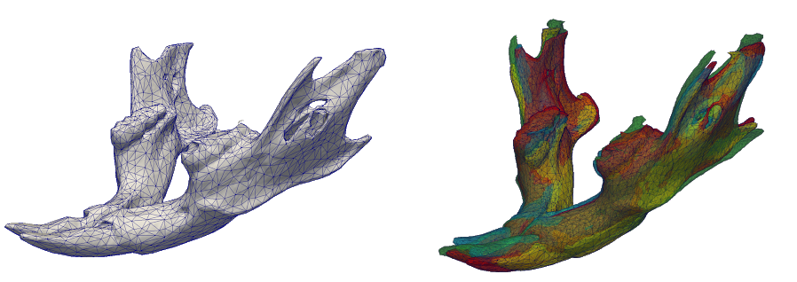
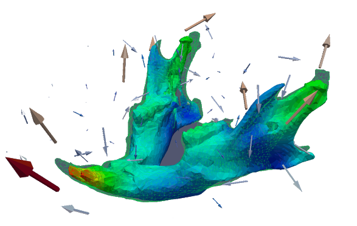

# Installation

Operating System Requirements: Anaconda 3, Linux or Mac OS X distributions

Absolutely required:

- Please install by following the relevant links

- FSL - https://fsl.fmrib.ox.ac.uk/fsl/fslwiki  (Image analysis tools) 

- Deformetrica - http://www.deformetrica.org/ (Atlasing tools)

- Git - https://git-scm.com/  (Code version-control system)

- ITK - https://itk.org/ (Segmentation and registration tools)

- VTK - https://vtk.org/      (Visualisation tools)

- CMake - https://cmake.org/   (Compiler)

- Meshlab - https://www.meshlab.net/ (Mesh cleaning and decimation)


-Python packages:

Matplotlib

Numpy

SimpleITK

Vtk

Pandas

Seaborn

Software we used but for which there may be similar alternatives:
Itksnap - http://www.itksnap.org/pmwiki/pmwiki.php  (Image manipulation tool)
Paraview - https://www.paraview.org/    (Image visualisation tools)
Mitk - http://mitk.org/wiki/The_Medical_Imaging_Interaction_Toolkit_(MITK) 
(Landmarking tool for coarse alignment )

This Pipeline has been tested on:

- macOS High sierra V10.13.6
- Deformetrica 3 and 4
- FSL 5.0.11
- ITK 4.12.2
- VTK 8.2.0
- CMake 3.12.1
- Python3

Pipeline can be directly downloaded. For information on how to install it, please see:[Installation](install.ipynb)

Start the pipeline from the terminal with:

```
ipython notebook
```


# Landmark-Free Morphometry

```Landmark-Free-Morphometry``` is a set of tools that aid the analysis of shapes (meshes) in a population without the need of landmark picking.




The aim of the library is to provide/provide a simplified way to:

- Perform binary segmentation of microCT Images (Fig. a-b)

- Extract sub-region of a segmented image from a Watershed approach (Fig. c)

- Transform a binary image into a smooth mesh (Fig. d)

- Perform rigid or affine alignment of multiple meshes (Fig. e)

- Perform population atlas from a set of meshes and extract variability of sub-groups using (Fig. f)

- Aid analysis of sub-group variabilities using an SVM classifier and PCAs.

## Demo

Each step of the pipeline includes instructions and relevant demo data set.
Depending on your hardware the pipeline should take between 4-8 hours to run.

For further tutorial on running the pipeline please refer to appendix A in the paper ( Inset paper link here )

## Content:

### [Pre-Processing](uCT-process.ipynb)



### [Mesh-Processing](mesh-process.ipynb)



### [Mesh-Alignment](mesh-alignment.ipynb)



### [Atlas-Construction](atlas-construction.ipynb)



### [Shape-Statistics](shape-statistics-analysis.ipynb)


## About

If you used the code for your research, please, cite the paper:

    @article{redheadtoussaint2018,
      title={},
      author={Redhead, Yushi and Toussaint, Nicolas},
      journal={},
      year={2018}
    }
