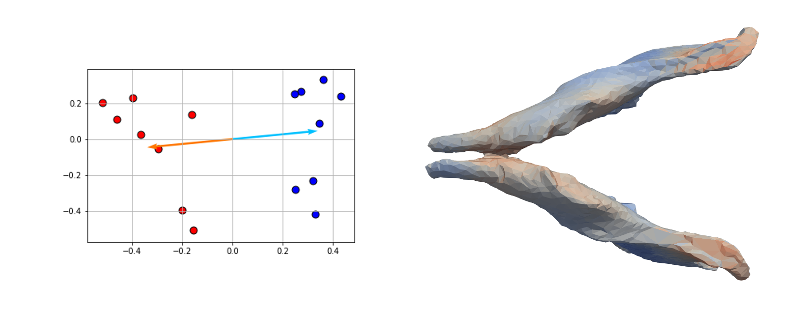

# Landmark-Free Morphometry

```Landmark-Free-Morphometry``` is a set of tools that aid the analysis of shapes (meshes) in a population without the need of landmark picking.


The aim of the library is to provide/provide a simplified way to:

- Perform binary segmentation of microCT Images (Fig. a-b)

- Extract sub-region of a segmented image from a Watershed approach (Fig. c)

- Transform a binary image into a smooth mesh (Fig. d)

- Perform rigid or affine alignment of multiple meshes (Fig. e)

- Perform population atlas from a set of meshes and extract variability of sub-groups using (Fig. f)

- Aid analysis of sub-group variabilities using an SVM classifier and PCAs.


## Content:

### [Pre-Processing](uCT-process.ipynb)


### [Mesh-Alignment](mesh-alignment.ipynb)


### [Atlas-Construction](atlas-construction.ipynb)


### [Shape-Statistics](shape-statistics-analysis.ipynb)




## Installation

This code requires:

- [git](https://git-scm.com/)

- [FSL](https://fsl.fmrib.ox.ac.uk)

- [ITK](http://www.itk.org)

- [VTK](http://www.vtk.org)

- [CMake](http://www.cmake.com)

- [Deformetrica](http://www.deformetrica.org)

- [Python](http://www.python.org)

- **Python packages**: Specified in each notebook


## About

If you used the code for your research, please, cite the paper:

    @article{redheadtoussaint2018,
      title={},
      author={Redhead, Yushi and Toussaint, Nicolas},
      journal={},
      year={2018}
    }
